# Hotel Management System

**Lokanata HMS** Sistem Manajemen Hotel berbasis web yang dirancang untuk mengelola seluruh operasional hotel secara digital, mulai dari pemesanan kamar online oleh tamu, pengelolaan reservasi oleh resepsionis, hingga manajemen tata graha (housekeeping). Dibangun dengan stack **Laravel 12 (Backend REST API)** dan **Vue.js 3 + Vite**.

**Pembuat:** Muhamad Farhan Muizaddin

---

## Fitur & Aktor Terlibat

Sistem ini melibatkan 4 aktor utama:

1.  **Tamu (Guest)**: Mengakses website hotel, melihat daftar kamar & harga, dan melakukan pemesanan kamar.
2.  **Resepsionis**: Mengelola booking online (terima/tolak), membuat reservasi manual, proses check-in & check-out, pencatatan pembayaran & faktur, serta mengelola data tamu.
3.  **Tata Graha (Housekeeping)**: Melihat daftar kamar yang perlu dibersihkan dan memperbarui status kebersihan kamar.
4.  **Admin / Manajer**: Memiliki akses penuh ke seluruh fitur sistem, termasuk dashboard statistik, manajemen staf, tipe kamar, daftar kamar, fasilitas, pengaturan landing page, dan laporan pendapatan/reservasi.

Autentikasi portal staf menggunakan session cookie Laravel Sanctum untuk SPA (CSRF cookie dan proteksi cookie), bukan bearer token. Endpoint publik tetap hanya tersedia untuk landing page, booking, dan pelacakan reservasi.

---

## Demo Aplikasi

Demo dipecah menjadi **22 klip pendek** (6–17 detik per klip) supaya ringan diputar dan mudah diunduh.
Semua rekaman memakai data nyata dari database pengembangan, bukan data dummy.

Klip video tersimpan di [`docs/demo-video/`](docs/demo-video) (format MP4, total ±6,3 MB).
Klik nama file pada tabel di bawah untuk mengunduh/menonton.

> **Ingin video diputar langsung di README?**
> GitHub hanya bisa memutar video yang diunggah lewat antarmuka web (tautan `user-attachments`),
> bukan file dari path repo. Untuk itu: buka repo ini → **Edit README.md** → seret file `.mp4` ke
> kolom editor, lalu GitHub otomatis membuat tautan yang bisa diputar. Screenshot di bawah sudah
> tampil langsung tanpa langkah tambahan.

### 1. Pengunjung (Guest Booking)

Alur pemesanan tamu dari mencari kamar sampai melacak reservasi.

| # | Halaman | Durasi | Video | Screenshot |
| --- | --- | --- | --- | --- |
| 1 | Beranda (hero + form cari kamar) | 11 dtk | [`tamu-01-beranda.mp4`](docs/demo-video/tamu-01-beranda.mp4) | 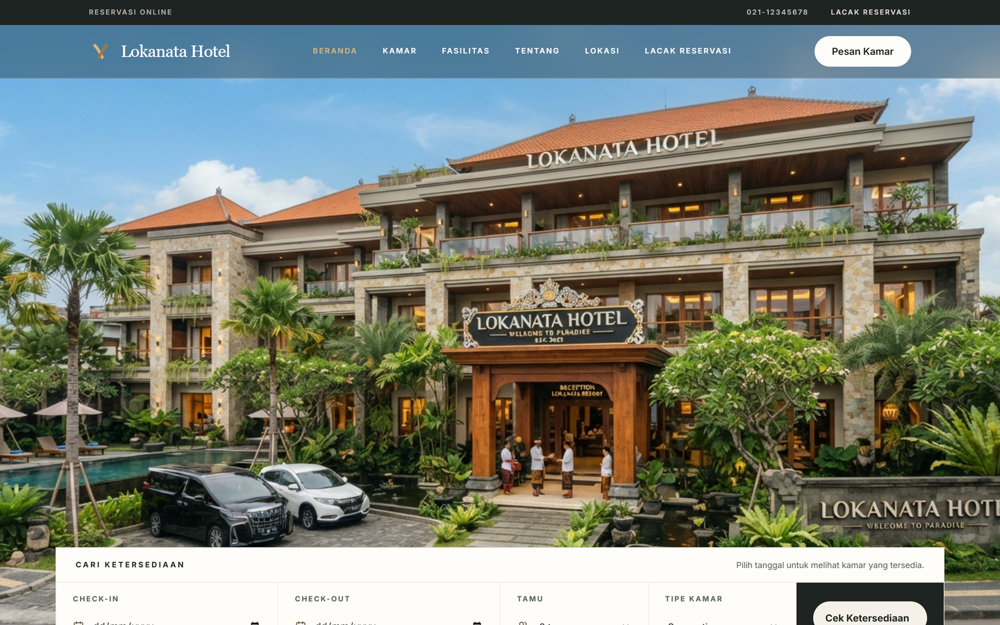 |
| 2 | Beranda (fasilitas, galeri, lokasi) | 14 dtk | [`tamu-02-fitur-beranda.mp4`](docs/demo-video/tamu-02-fitur-beranda.mp4) | — |
| 3 | Daftar kamar | 7 dtk | [`tamu-03-daftar-kamar.mp4`](docs/demo-video/tamu-03-daftar-kamar.mp4) | 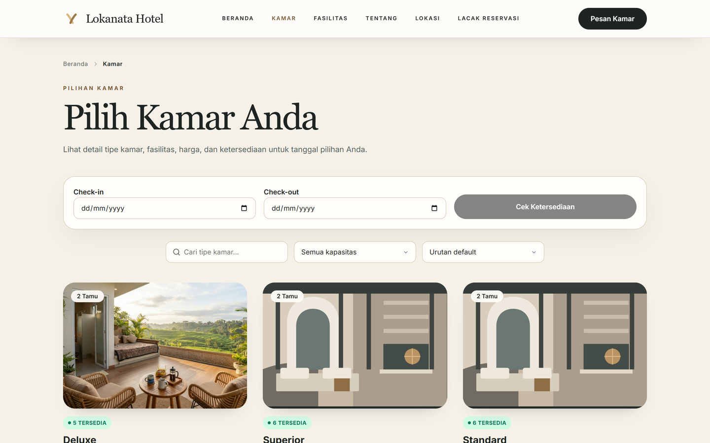 |
| 4 | Detail kamar (galeri auto-slide) | 17 dtk | [`tamu-04-detail-kamar.mp4`](docs/demo-video/tamu-04-detail-kamar.mp4) | 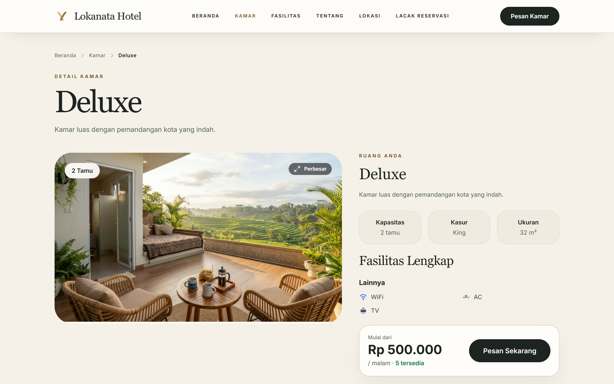 |
| 5 | Form booking | 8 dtk | [`tamu-05-form-booking.mp4`](docs/demo-video/tamu-05-form-booking.mp4) | 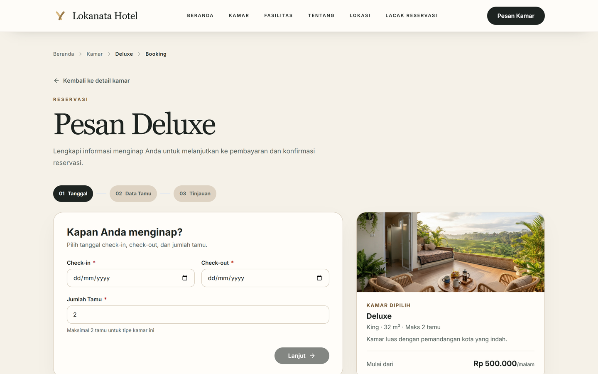 |
| 6 | Lacak reservasi | 6 dtk | [`tamu-06-lacak-reservasi.mp4`](docs/demo-video/tamu-06-lacak-reservasi.mp4) | 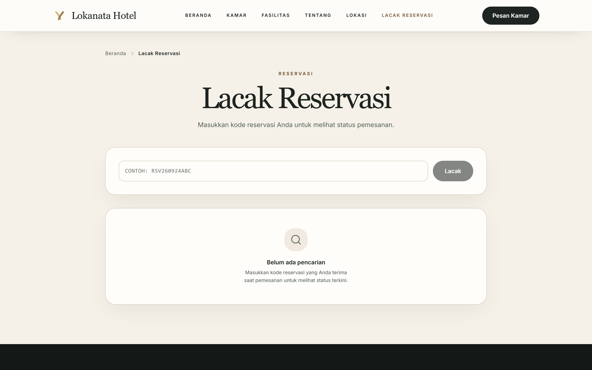 |

### 2. Admin (Manajemen Sistem)

Seluruh modul, dari master data, operasional harian, hingga laporan keuangan.

| # | Modul | Durasi | Video | Screenshot |
| --- | --- | --- | --- | --- |
| 1 | Dashboard (statistik & grafik) | 7 dtk | [`admin-01-dashboard.mp4`](docs/demo-video/admin-01-dashboard.mp4) | 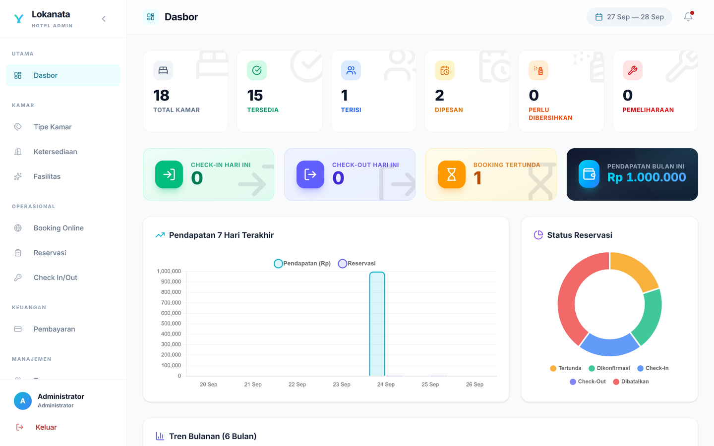 |
| 2 | Tipe kamar | 6 dtk | [`admin-02-tipe-kamar.mp4`](docs/demo-video/admin-02-tipe-kamar.mp4) | 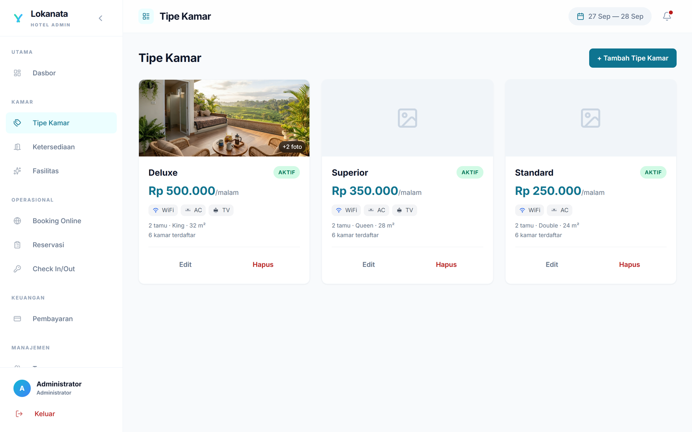 |
| 3 | Master kamar & fasilitas | 10 dtk | [`admin-03-master-kamar.mp4`](docs/demo-video/admin-03-master-kamar.mp4) | — |
| 4 | Booking online & reservasi | 12 dtk | [`admin-04-booking-reservasi.mp4`](docs/demo-video/admin-04-booking-reservasi.mp4) | 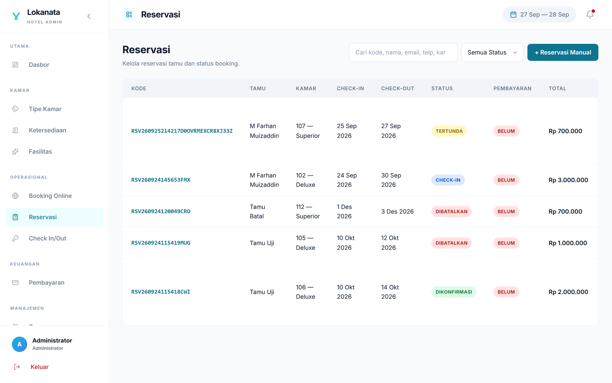 |
| 5 | Check-in / check-out | 7 dtk | [`admin-05-checkinout.mp4`](docs/demo-video/admin-05-checkinout.mp4) | 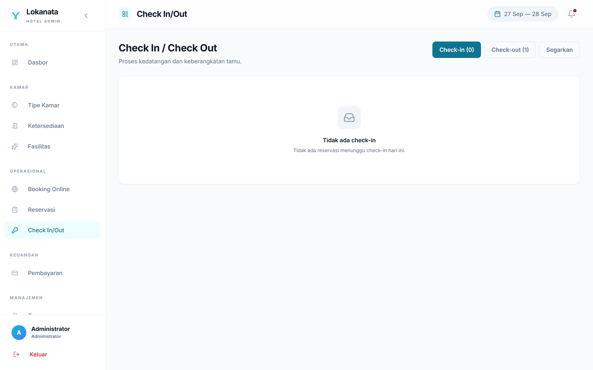 |
| 6 | Pembayaran | 7 dtk | [`admin-06-pembayaran.mp4`](docs/demo-video/admin-06-pembayaran.mp4) | — |
| 7 | Data tamu | 6 dtk | [`admin-07-tamu.mp4`](docs/demo-video/admin-07-tamu.mp4) | — |
| 8 | Housekeeping & staf | 10 dtk | [`admin-08-housekeeping-staf.mp4`](docs/demo-video/admin-08-housekeeping-staf.mp4) | — |
| 9 | Laporan | 7 dtk | [`admin-09-laporan.mp4`](docs/demo-video/admin-09-laporan.mp4) | 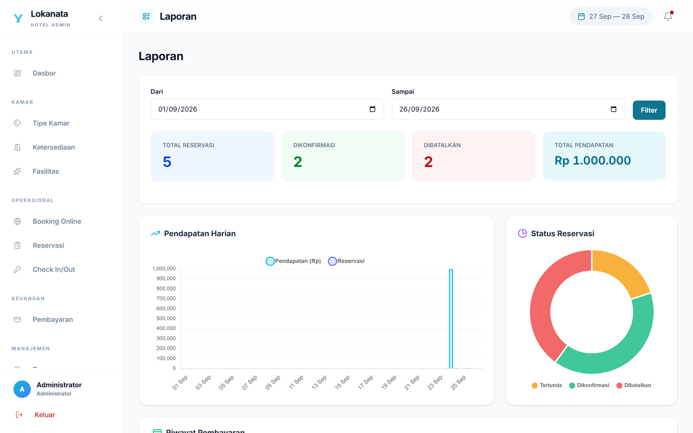 |
| 10 | Pengaturan | 6 dtk | [`admin-10-pengaturan.mp4`](docs/demo-video/admin-10-pengaturan.mp4) | — |

### 3. Resepsionis (Operasional Harian)

Fokus pada penanganan tamu di front desk.

| # | Modul | Durasi | Video | Screenshot |
| --- | --- | --- | --- | --- |
| 1 | Dashboard | 7 dtk | [`resepsionis-01-dashboard.mp4`](docs/demo-video/resepsionis-01-dashboard.mp4) | 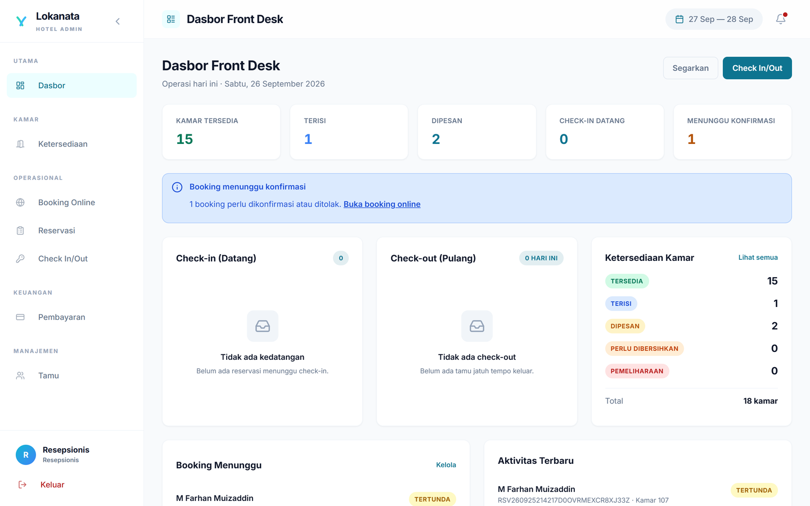 |
| 2 | Status kamar | 7 dtk | [`resepsionis-02-kamar.mp4`](docs/demo-video/resepsionis-02-kamar.mp4) | 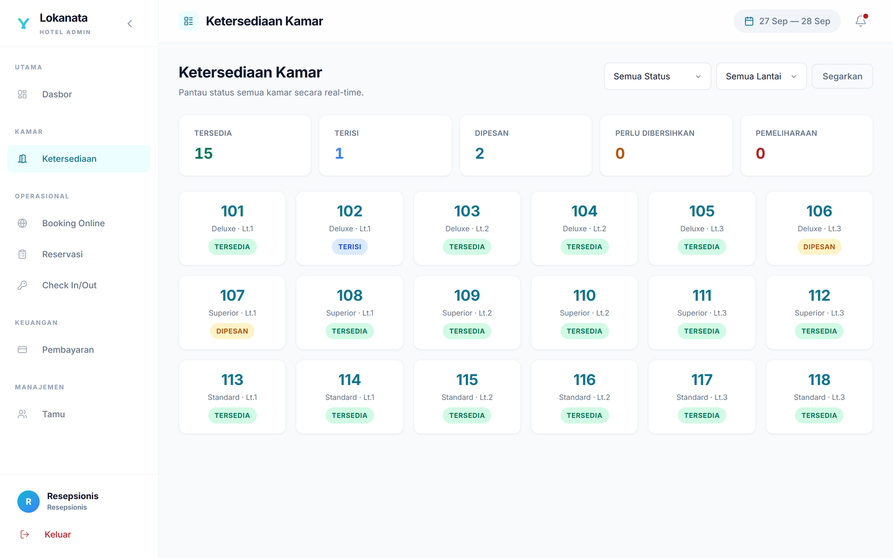 |
| 3 | Booking online & reservasi | 11 dtk | [`resepsionis-03-booking-reservasi.mp4`](docs/demo-video/resepsionis-03-booking-reservasi.mp4) | — |
| 4 | Check-in / check-out | 7 dtk | [`resepsionis-04-checkinout.mp4`](docs/demo-video/resepsionis-04-checkinout.mp4) | — |
| 5 | Pembayaran & data tamu | 10 dtk | [`resepsionis-05-pembayaran-tamu.mp4`](docs/demo-video/resepsionis-05-pembayaran-tamu.mp4) | — |

### 4. Housekeeping (Tata Graha)

Daftar kamar yang perlu dibersihkan beserta pembaruan status kebersihan.

| # | Modul | Durasi | Video | Screenshot |
| --- | --- | --- | --- | --- |
| 1 | Status kebersihan kamar | 7 dtk | [`housekeeping-01-status-kebersihan.mp4`](docs/demo-video/housekeeping-01-status-kebersihan.mp4) | 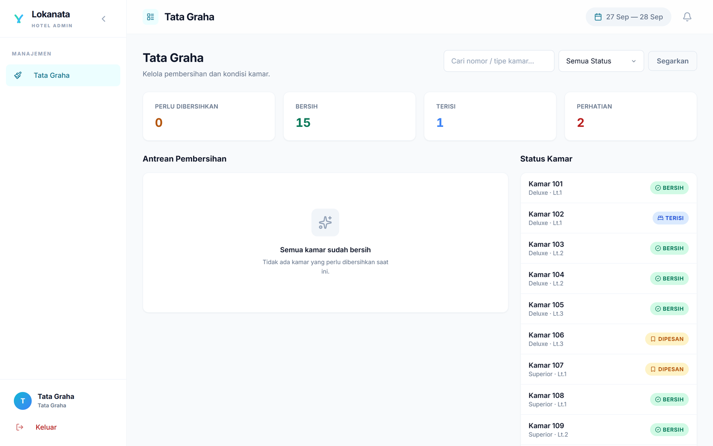 |

### Akun Demo

| Peran | Email |
| --- | --- |
| Admin | `admin@lokanata.com` |
| Resepsionis | `resepsionis@lokanata.com` |
| Tata Graha | `housekeeping@lokanata.com` |

Password akun demo diatur melalui environment `DEMO_USER_PASSWORD` dan hanya dibuat pada
environment `local`/`testing`.

## Struktur & Perancangan Sistem

### 1. Database Entity Relationship Diagram (ERD)
Sistem database ini memiliki 10 tabel domain dengan integritas relasi antar-tabel.
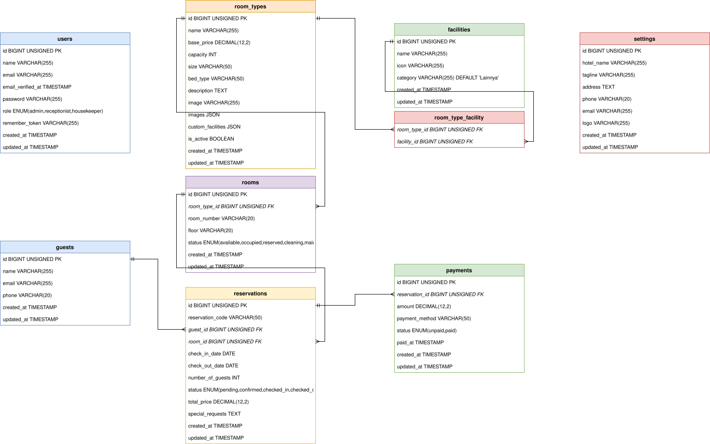

### 2. Use Case Diagram
Diagram ini memperlihatkan interaksi setiap aktor terhadap 17 fungsionalitas utama sistem.
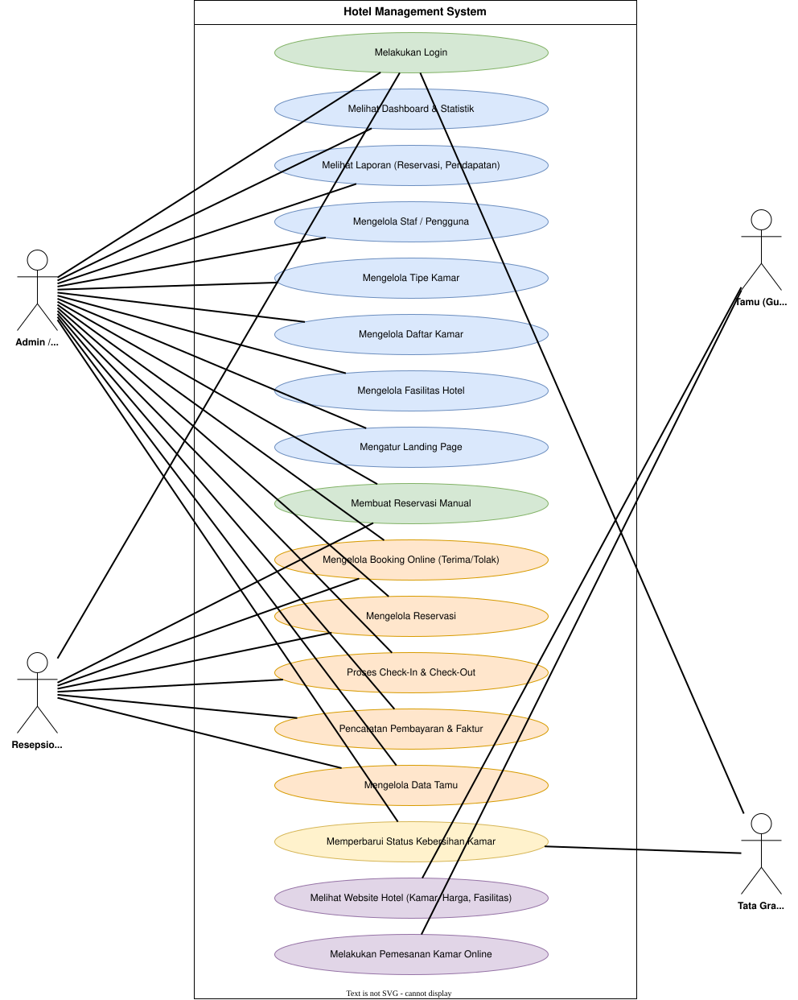

### 3. User Flow Diagram
Alur jalannya interaksi user dari 4 perspektif: Tamu, Resepsionis, Tata Graha, dan Admin.


---

## Menjalankan Aplikasi

Aplikasi menggunakan stack berikut:
- **PHP** >= 8.2
- **Composer** v2+
- **Node.js** v20.19+ (`.nvmrc` tersedia di `frontend/`)
- **Database** MySQL / MariaDB (Dianjurkan via Container/Docker)

### Menjalankan via Docker (Development)

Docker Compose menyediakan workflow development dengan pemetaan port lokal dan volume bernama. Compose ini hanya untuk development, bukan konfigurasi production.

**1. Siapkan environment Compose**

Salin template dari root project:
```bash
cp .env.example .env
```

Di PowerShell, gunakan `Copy-Item .env.example .env`. Jangan commit file `.env`.

**2. Isi secret dan APP_KEY**

Edit `.env`, lalu isi `DB_PASSWORD` dan `DB_ROOT_PASSWORD` dengan password kuat dan unik. Jangan memakai credential default. Generate APP_KEY dengan PHP:
```bash
php -r "echo 'APP_KEY=base64:' . base64_encode(random_bytes(32)) . PHP_EOL;"
```

Salin baris hasil perintah ke `APP_KEY` pada `.env`. Nilai `RUN_MIGRATIONS=true` menjalankan migration saat container backend mulai; ubah menjadi `false` bila migration dikelola terpisah.

**3. Jalankan container**
```bash
docker compose up -d --build
```

URL development:
- **Frontend App (Docker):** `http://localhost:3000`
- **Backend/API:** `http://localhost:8000`
- **phpMyAdmin:** `http://localhost:8080`

Port Docker dipublish hanya ke `127.0.0.1`. Login phpMyAdmin menggunakan user root dan password yang disimpan di `DB_ROOT_PASSWORD`.

### Menjalankan Tanpa Docker (Manual)

**1. Siapkan Database**

Pastikan MySQL/MariaDB berjalan, buat database, dan siapkan credential database Anda sendiri.

**2. Setup Backend**

```bash
cd backend
composer install
cp .env.example .env
```

Sesuaikan `backend/.env` untuk database lokal. Template manual menggunakan `DB_HOST=127.0.0.1`, `FRONTEND_URL=http://localhost:5173`, `SANCTUM_STATEFUL_DOMAINS=localhost:5173,localhost:8000`, dan `SESSION_SECURE_COOKIE=false`. Isi credential database secara manual, lalu jalankan:
```bash
php artisan key:generate
php artisan migrate --force
php artisan storage:link
php artisan serve --host=127.0.0.1 --port=8000
```

`php artisan db:seed` bersifat idempotent untuk data master. Akun demo hanya dibuat pada environment `local`/`testing` bila `DEMO_USER_PASSWORD` diisi secara lokal; production harus membuat akun staf melalui prosedur provisioning yang dikontrol.

**3. Setup Frontend**

Buka terminal baru:
```bash
cd frontend
npm ci
npm run dev
```

**4. Akses Aplikasi**
- **Frontend App (manual):** `http://localhost:5173`
- **Backend/API:** `http://localhost:8000`

Untuk manual development, pastikan `FRONTEND_URL` dan `SANCTUM_STATEFUL_DOMAINS` menggunakan port `5173`/`8000` serta `DB_HOST=127.0.0.1`. Untuk Docker, root `.env` memakai `DB_HOST=db` dan port frontend `3000`; proxy internal Vite mengarah ke `http://backend:8000`.

### Catatan Deployment

Docker Compose di repository ini development-only. Production memerlukan TLS dan reverse proxy, secret manager untuk `APP_KEY` serta password, `APP_DEBUG=false`, `SESSION_SECURE_COOKIE=true`, dan migration yang dikelola secara terkontrol. Repository ini tidak menyediakan konfigurasi production atau jaminan keamanan deployment. Jika credential lama pernah dipakai di environment publik, rotasi password database/root, akun staf, dan `APP_KEY`, invalidate seluruh session, serta amankan atau hapus log lama.

### Verifikasi

```bash
cd backend
composer validate --strict
composer audit --locked
vendor/bin/pint --test
php artisan test
```

```bash
cd frontend
npm ci
npm audit
npm run build
```

Feature test backend mencakup role isolation, authentication JSON response, kapasitas dan konflik booking, transisi check-in/out, payment balance, housekeeping, pelacakan publik, dan penghapusan data historis. Frontend belum memiliki automated unit/E2E test; verifikasi frontend saat ini mencakup production build dan smoke test manual.

---

## Struktur Project

```
lokanata-hotel-management/
|-- backend/                         # Laravel 12 (REST API)
|   |-- app/
|   |   |-- Http/
|   |   |   |-- Controllers/
|   |   |   |   |-- Admin/          # Controller (Dashboard, CRUD Master Data, Laporan)
|   |   |   |   |-- Auth/           # Login Controller
|   |   |   |   |-- Guest/          # Controller (Landing Page, Booking Online)
|   |   |   |   |-- Housekeeper/    # Controller (Status Kebersihan Kamar)
|   |   |   |   |-- Receptionist/   # Controller (Reservasi, Check-In/Out, Pembayaran)
|   |   |   |-- Middleware/
|   |   |-- Models/                  # Model Eloquent
|   |-- database/
|   |   |-- migrations/             # File migrasi tabel
|   |   |-- seeders/
|   |-- routes/
|   |   |-- api.php                 # Seluruh definisi route REST API
|   |-- Dockerfile
|   |-- docker-entrypoint.sh
|   |-- .env.example
|   |-- composer.json
|
|-- frontend/                        # Vue.js 3 + Vite + Tailwind CSS v4
|   |-- src/
|   |   |-- components/
|   |   |   |-- layout/             # AppLayout, Sidebar, Navbar
|   |   |-- router/                 # Vue Router (role-based routing)
|   |   |-- services/               # Axios instance & interceptor
|   |   |-- stores/                 # Pinia state management
|   |   |-- views/
|   |   |   |-- admin/              # Halaman Admin (Dashboard, Kamar, Staf, dll)
|   |   |   |-- auth/               # Halaman Login
|   |   |   |-- landing/            # Halaman Publik (Home, Daftar Kamar, Booking)
|   |   |-- App.vue
|   |   |-- main.js
|   |-- diagrams/                   # SVG Diagram (ERD, Use Case, User Flow)
|   |-- Dockerfile
|   |-- package.json
|
|-- docs/
|   |-- screenshots/               # Screenshot halaman (dirender di README)
|   |-- demo-video/                # Rekaman demo per halaman (MP4)
|
|-- docker-compose.yml

|-- .env.example
|-- .gitignore
|-- README.md
```

---

## Lisensi

Project ini dilisensikan di bawah MIT License.

```
MIT License

Copyright (c) 2026 Muhamad Farhan Muizaddin

Permission is hereby granted, free of charge, to any person obtaining a copy
of this software and associated documentation files (the "Software"), to deal
in the Software without restriction, including without limitation the rights
to use, copy, modify, merge, publish, distribute, sublicense, and/or sell
copies of the Software, and to permit persons to whom the Software is
furnished to do so, subject to the following conditions:

The above copyright notice and this permission notice shall be included in all
copies or substantial portions of the Software.

THE SOFTWARE IS PROVIDED "AS IS", WITHOUT WARRANTY OF ANY KIND, EXPRESS OR
IMPLIED, INCLUDING BUT NOT LIMITED TO THE WARRANTIES OF MERCHANTABILITY,
FITNESS FOR A PARTICULAR PURPOSE AND NONINFRINGEMENT. IN NO EVENT SHALL THE
AUTHORS OR COPYRIGHT HOLDERS BE LIABLE FOR ANY CLAIM, DAMAGES OR OTHER
LIABILITY, WHETHER IN AN ACTION OF CONTRACT, TORT OR OTHERWISE, ARISING FROM,
OUT OF OR IN CONNECTION WITH THE SOFTWARE OR THE USE OR OTHER DEALINGS IN THE
SOFTWARE.
```
